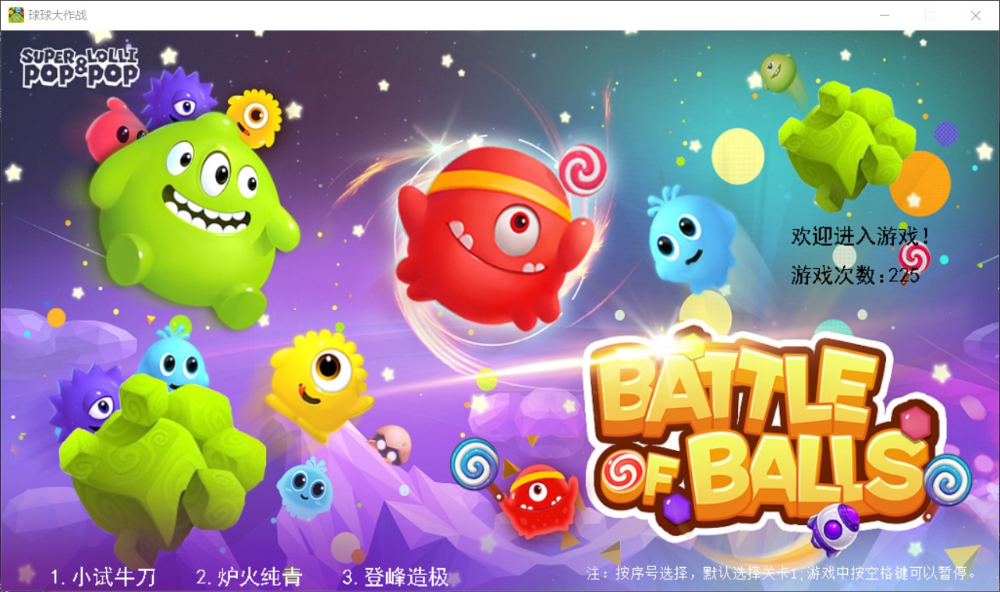
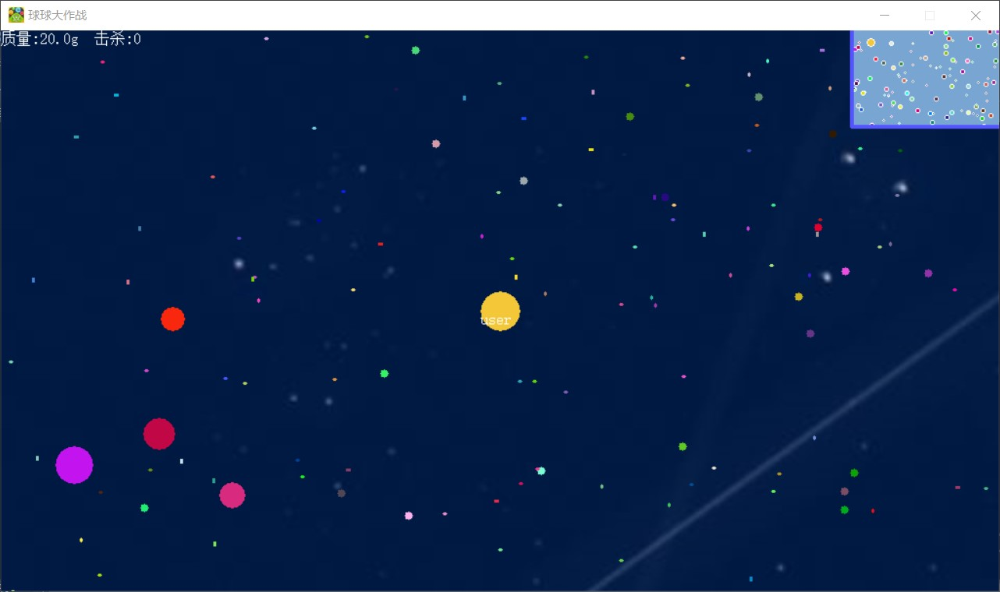
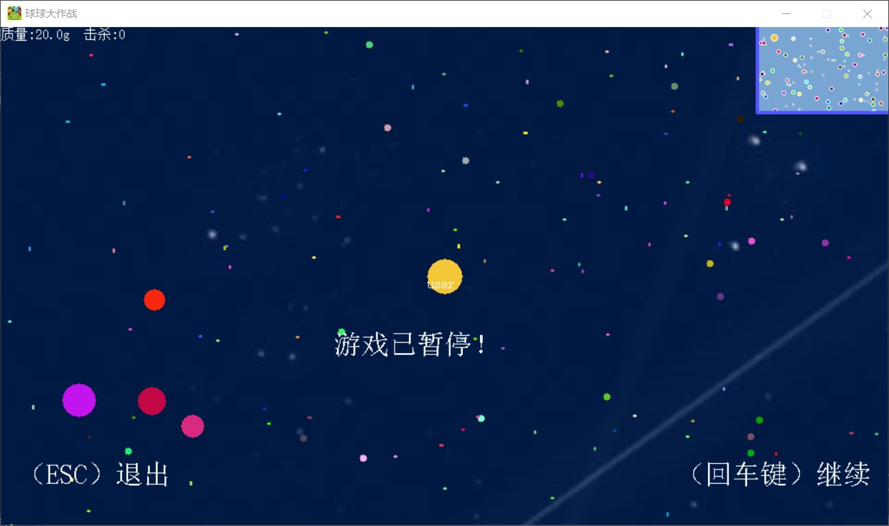
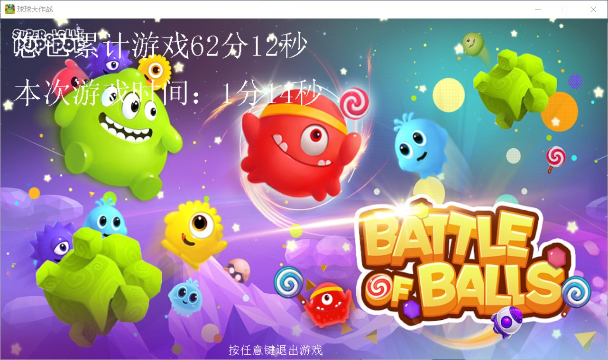
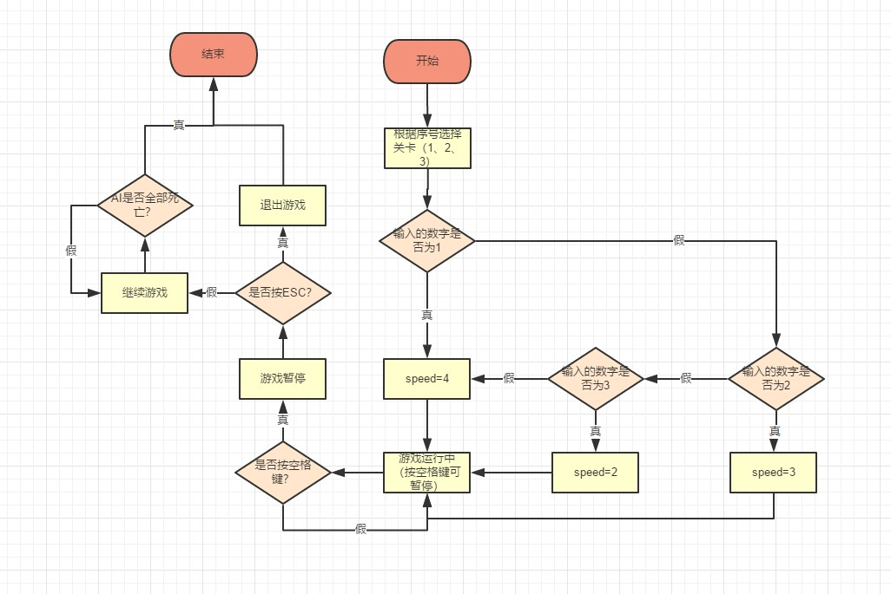

##### 1 引言

《球球大作战》虽然在玩法上类似于大球吃小球的模式看起来很单薄。但是在游戏过程中会出现无数种意外情况，这就需要玩家运用一系列策略来达到不被吃和吃掉别人球的目的，大大增加了游戏的耐玩性。游戏彻底抛弃了枯燥无味的单机模式，采取全球玩家联网实时对战。当竞技在PC端打的火热的时候，《球球大作战》率先引进了微竞技的新模式，让玩家在休闲的同时还能体验到竞技的乐趣，这种尝试也博得了一片称赞声。

 

1.1 编写目的

球球大作战在在最近几年风靡全球，其版本也在不断迭代。本项目取其最核心的玩

法，给玩家一个最纯粹的休闲游戏体验。此外《球球大作战（简易版）》是基于Easyx图形库开发出来的，在用户界面显示方面表现良好，相信一定会给用户一个不错的游戏体验。

 

1.2 开发背景

《球球大作战》是民族自研，积极健康休闲竞技游戏的代表。轻快明亮的画风、休闲有趣的玩法、富有深度的竞技性，使其成为国产手游创新模范。作为目前最具人气的移动电竞游戏，《球球大作战》累积用户数已超过1.7亿，最高同时在线人数突破175万。月活跃用户达到6000万。年轻化也是《球球大作战》的一大特色，朝气活力的学生群体是游戏主力军，95后及00后用户占比极高。

 

1.3 可行性分析

1.3.1 经济可行性

本项目是基于C语言开发，开发平台我们选择Visual Studio 2017 Community，此版本为免费版，由Microsoft公司免费提供给开发者使用；主流的开发环境有Windows和Linux，我们选择使用Windows进行开发，因为Windows我们比较熟悉，方便我们快速入手项目开发，所以需要一台安装了Windows操作系统的计算机；此外还使用了Easyx图形库，这个图形库也是免费提供给开发者使用和学习的。因此，总的经济方面付出不高，故经济可行性较高。

 

1.3.2 技术可行性

本项目大部分使用了C语言的语法，还使用少量的C++语法，调用了Easyx图形库。C语言方面，大部分知识是可以比较容易实现的，少部分通过翻书和查阅资料也是能够实现的。C++方面的语法，我们则较为不熟悉，需要花费较多的时间去了解。

 

1.4 问题定义

完成一个简易版的球球大作战项目，如何实现大球吃小球的功能？如何实现小球的移动和地图的刷新？如何实现游戏的暂停？等等......

 

1.5 参考文献

[1] 叶安胜, 鄢涛. C语言综合项目实战[M]. 科学出版社, 2015.

[2] David Griffiths. 深入浅出C语言. 东南大学出版社, 2013.

[3] Stephen Prata. C Primer Plus（第6版 中文版）. 人民邮电出版社, 2016.

[4] [啊哈磊](http://search.dangdang.com/?key2=%B0%A1%B9%FE%C0%DA&medium=01&category_path=01.00.00.00.00.00). 啊哈C语言！逻辑的挑战（修订版）. [电子工业出版社](http://search.dangdang.com/?key3=%B5%E7%D7%D3%B9%A4%D2%B5%B3%F6%B0%E6%C9%E7&medium=01&category_path=01.00.00.00.00.00), 2017.

[5] [啊哈磊](http://search.dangdang.com/?key2=%B0%A1%B9%FE%C0%DA&medium=01&category_path=01.00.00.00.00.00). 啊哈！算法. 人民邮电出版社, 2014.

[6]  https://www.baidu.com/[百度]

[7] https://easyx.cn/[Easyx]


##### 2 需求分析

2.1 需求分析图


 

2.2 功能需求分析

1）地图。利用easyx图形库生成一个适当大小的白色背景地图，和在右上角生成一个浅灰色的小地图用于显示玩家和AI的缩略图与位置。

2）文件存储。利用文件操作存储累计游戏次数和游戏时间。

3）玩家。初始化玩家球（包括坐标、生命值、颜色、大小、形状）。

4）AI(机器人)。初始化AI，生成指定数量的AI，每个AI随机坐标，生命值均为1，颜色随机，大小固定与玩家相同，形状为圆形。

5）生命。玩家和AI初始生命值均为1表示活，死后生命值变为0。

6）食物。随机位置生成指定数量的食物，颜色随机，大小在一定范围内随机，形状为圆形、椭圆形、圆角矩形等随机。

7）思路。玩家通过方向键控制球移动；大球吃小球，若a.r>b.r且a和b  圆心距d<a.r+b.r，则a.r = sqrt(a.r*a.r + b.r*b.r)，b.r=0，b的生命变为0。所有AI的生命都变为0时，游戏结束，获得胜利。

8）玩家如果被AI吃，玩家生命变为0，游戏结束，游戏失败，显示游戏累 计时间。

2.3 性能需求分析

1）性能：程序总体占用空间较小，响应时间较块。

2）可修改性：程序代码层次清晰，主要注释均有，便于后期修改与维护。

3）可用性：程序目前为止尚未出现崩溃情况，可用性较高。

4）易用性：游戏规则简单，即使是新手也能很快熟练的游戏。

 

**3** **概要设计**

3.1 运行环境

3.1.1 Windows 10

Windows操作系统是最常见的计算机操作系统，是微软公司开发的操作软件。该软件经历了多年的发展历程，目前推出的win10系统相当成熟。Windows操作系统具有人机操作互动性好，支持应用软件多，硬件适配性强等特点，未来该系统将更加安全、智能、易用。

操作系统是将人类利用计算机硬件发挥作用的平台，是计算机软件运行工作的环境，是计算机硬件的翻译。从计算机诞生发展到今天，出现了相当多种类的操作系统。Windows操作系统是其中的佼佼者。Windows操作系统是美国微软公司推出的一款操作系统。该系统从1985年诞生到现在，经过多年的发展完善，相对比较成熟稳定，是当前个人计算机的主流操作系统。

3.2 开发平台及技术基础

3.2.1 Visual Studio 2017

Microsoft Visual Studio是VS的全称。VS是美国微软公司的开发工具包系列产品。VS是一个基本完整的开发工具集，它包括了整个软件生命周期中所需要的大部分工具，如UML工具、代码管控工具、集成开发环境(IDE)等等。所写的目标代码适用于微软支持的所有平台，包括Microsoft Windows、Windows Mobile、Windows CE、.NET Framework、.Net Core、.NET Compact Framework和Microsoft Silverlight 及Windows Phone。

   Visual Studio是目前最流行的Windows平台应用程序的集成开发环境。最新版本为 Visual Studio 2019版本，基于.NET Framework 4.7。

3.2.2 Easyx图形库

EasyX 是针对 C++ 的图形库，可以帮助 C 语言初学者快速上手图形和游戏编程。比如，可以用 VC + EasyX 很快的用几何图形画一个房子，或者一辆移动的小车，可以编写俄罗斯方块、贪吃蛇、黑白棋等小游戏，可以练习图形学的各种算法，等等。

许多学编程的都是从 C 语言开始入门的，而目前的现状是：

（1）有些学校以 Turbo C 为环境讲 C 语言，只是 Turbo C 的环境实在太老了，复制粘贴都很不方便。

（2） 有些学校直接拿 VC 来讲 C 语言，因为 VC 的编辑和调试环境都很优秀，并且 VC 有适合教学的免费版本。可惜在 VC 下只能做一些文字性的练习题，想画条直线画个圆都很难，还要注册窗口类、建消息循环等等，初学者会受严重打击的。初学编程想要绘图就得用 TC，很是无奈。

（3） 还有计算机图形学，这门课程的重点是绘图算法，而不是 Windows 编程。所以，许多老师不得不用 TC 教学，因为 Windows 绘图太复杂了，会偏离教学的重点。新的图形学的书有不少是用的 OpenGL，可是门槛依然很高。

所以，我们想给大家一个更好的学习平台，就是 VC 方便的开发平台和 TC 简单的绘图功能，于是就有了这个 EasyX 库。如果您刚开始学 C 语言，或者您是一位教 C 语言的老师，再或者您在教计算机图形学，那么这个库一定会让您兴奋的。

 

3.3 基本设计概要及处理流程

3.3.1 基本设计概要

1) 游戏主界面模块



 

2) 游戏运行模块



 

3) 游戏暂停模块



 

4) 计时模块



3.3.2 流程处理（流程图）



3.4 结构图

 


**4** **详细设计**

 

4.1 功能模块实现

4.1.1 程序运行次数和累计时间的存储与读写

定义文件名:

```c
#define FilePath1 "timeer.txt"
#define FilePath "counter.txt"
```

 记录游戏运行次数的文件读写:

```c
int readCount() {
	FILE *fp;
	int count;
	if ((fp = fopen(FilePath, "r")) == NULL) {
		return 0;
	}
	else
		fscanf(fp, "%d", &count);
	fclose(fp);
	return count;
}

void writeCount(int count) {
	FILE *fp;
	if ((fp = fopen(FilePath, "w")) == NULL) {
		printf("无法创建数据文件:counter.txt。\n");
		return;
	}
	else
		fprintf(fp, "%d", count);
	fclose(fp);
}
```

记录游戏累计时间的文件的读写:

```c
int readTime() {
	FILE *fp1;
	int time;
	if ((fp1 = fopen(FilePath1, "r")) == NULL) {
		return 0;
	}
	else
		fscanf(fp1, "%d", &time);
	fclose(fp1);
	return time;
}

void writeTime(int time) {
	FILE *fp1;
	if ((fp1 = fopen(FilePath1, "w")) == NULL) {
		printf("无法创建数据文件：timeer.txt。\n");
		return;
	}
	else
		fprintf(fp1, "%d", time);
	fclose(fp1);
}

```

4.1.2 游戏难度的控制

通过改变移动速度增加难度:

```c
void ChooseSpeed() {
	switch (getch()) {
	case 1:speed = 4;
	case 2:speed = 3;
	case 3:speed = 2;
	default:speed = 4;
	}
}
```

4.1.3 游戏运行时间的计算及其显示

游戏累计时间的计算及显示:

```c
void starttime() {
	start_t = clock();
	writeCount(readCount() + 1);
}

void endtime() {
	closegraph();
	initgraph(WIDTH, HEIGHT);
	cleardevice();
	BeginBatchDraw();
	setbkcolor(WHITE);							// 白色背景
	cleardevice();								// 初始化背景
	settextcolor(BLACK);							// 改字体
	setbkmode(TRANSPARENT);
	end_t = clock();
	total_t = (end_t - start_t);
	IMAGE image;
	loadimage(&image, _T("../resourse/start.jpg"), WIDTH, HEIGHT);
	putimage(0, 0, &image);
	settextstyle(50, 0, _T("宋体"));
	setlinestyle(PS_NULL);
	TCHAR str[64];
	swprintf_s(str, _T("本次游戏时间：%d分%d秒"), total_t / 60000, total_t / 1000 - total_t / 60000 * 60);
	settextcolor(WHITE);							// 改字体
	outtextxy(20, 100, str);
	total_t = readTime() + total_t;
	writeTime(total_t);
	TCHAR str1[64];
	swprintf_s(str1, _T("您已累计游戏%d分%d秒"), total_t / 60000, total_t / 1000 - total_t / 60000 * 60);
	settextcolor(WHITE);							// 改字体
	outtextxy(20, 20, str1);
	settextstyle(20, 0, _T("宋体"));
	outtextxy(384, 550, _T("按任意键退出游戏"));
	FlushBatchDraw();
	getchar();
	closegraph();
	exit(1);		//考虑增加重新开始游戏
}
```

4.1.4 游戏结束的判定

通过life的值判断是否结束游戏:

```c
if (ball->r <= 0)
		ball->life = false;
	if (ball->life == false) {						// 判定游戏是否接束
		HWND hwnd = GetHWnd();
		MessageBox(hwnd, _T("你被吃了"), _T("游戏结束"), MB_ICONEXCLAMATION);
		endtime();

	}

	if (eaten + ai_eaten == AINUM)					// 是否吃掉所有 AI
	{
		HWND hwnd = GetHWnd();
		MessageBox(hwnd, _T("恭喜过关"), _T("游戏结束"), MB_OK | MB_ICONEXCLAMATION);	// 结束
		endtime();
	}
```

4.1.5 玩家的移动

向键控制移动:

```c
	static int mx = 0, my = 0;						// 记录偏移量

	if (GetAsyncKeyState(VK_UP) && (ball->y - ball->r > 0 && ball->y <= (MAPH - ball->r + 10))) {
		ball->y -= speed;
		my += speed;
	}
	if (GetAsyncKeyState(VK_DOWN) && (ball->y - ball->r >= -10 && ball->y < (MAPH - ball->r))) {
		ball->y += speed;
		my -= speed;
	}
	if (GetAsyncKeyState(VK_LEFT) && ball->x - ball->r > 0 && (ball->x <= (MAPW - ball->r + 10))) {
		ball->x -= speed;
		mx += speed;
	}
	if (GetAsyncKeyState(VK_RIGHT) && ball->x - ball->r >= -10 && (ball->x < (MAPW - ball->r))) {
		ball->x += speed;
		mx -= speed;
	}
```

4.1.6 游戏暂停

按空格键游戏暂停:

```c
if (GetAsyncKeyState(VK_SPACE)) {
		settextcolor(WHITE);
		settextstyle(32, 0, _T("宋体"));
		outtextxy(384 - mx, 350 - my, _T("游戏已暂停！"));
		outtextxy(20 - mx, 500 - my, _T("（ESC）退出"));
		outtextxy(780 - mx, 500 - my, _T("（回车键）继续"));
		FlushBatchDraw();
		getch();
		if (GetAsyncKeyState(VK_ESCAPE))
			exit(0);
		else
			getch();
	}

```

4.1.7 食物的生成

食物的随机生成:

```c
void Food() {
	for (int i = 0; i < FNUM; i++) {				// 食物刷新
		if (food[i].eat == 0) {
			food[i].eat = 1;
			food[i].color = RGB(rand() % 256, rand() % 256, rand() % 256);
			food[i].x = rand() % MAPW;
			food[i].y = rand() % MAPH;
			food[i].type = rand() % 10 + 1;
		}
	}
}
```

绘制食物：

```c
for (int i = 0; i < FNUM; i++) {				// 画出食物
		if (food[i].eat == 0) continue;
		setfillcolor(food[i].color);
		switch (food[i].type) {					// 形状
		case 1:		solidellipse(food[i].x, food[i].y, food[i].x + 2, food[i].y + 4); break;
		case 2:		solidellipse(food[i].x, food[i].y, food[i].x + 4, food[i].y + 2);	break;
		case 3:		solidrectangle(food[i].x, food[i].y, food[i].x + 4, food[i].y + 2); break;
		case 4:		solidrectangle(food[i].x, food[i].y, food[i].x + 2, food[i].y + 4); break;
		case 5:		solidroundrect(food[i].x, food[i].y, food[i].x + 2, food[i].y + 4, 2, 2); break;
		case 6:		solidroundrect(food[i].x, food[i].y, food[i].x + 4, food[i].y + 2, 2, 2); break;
		case 7:		solidroundrect(food[i].x, food[i].y, food[i].x + 4, food[i].y + 2, 4, 2); break;
		case 8:		solidroundrect(food[i].x, food[i].y, food[i].x + 4, food[i].y + 2, 2, 4); break;
		case 9:		solidroundrect(food[i].x, food[i].y, food[i].x + 4, food[i].y + 2, 1, 1); break;
		case 10:	fillcircle(food[i].x, food[i].y, 4); break;
		}
	}
```

4.2 重难点分析

4.2.1 时间的计算：调用“time.h”头文件。

时间的计算:

```c
	clock_t start_t, end_t;
	int total_t;
	...
	end_t = clock();
	total_t = (end_t - start_t);
	...
	total_t = readTime() + total_t;
	writeTime(total_t);
```

 

4.2.2 游戏结束的判断：通过为生命赋值来解决，true表示存活，false表示死亡。   

游戏结束的判断:

```c
if (ball->r <= 0)
		ball->life = false;
	if (ball->life == false) {						// 判定游戏是否接束
		HWND hwnd = GetHWnd();
		MessageBox(hwnd, _T("你被吃了"), _T("游戏结束"), MB_ICONEXCLAMATION);
		endtime();

	}
```

4.2.3 小地图的绘制：调用了Easyx图形库里面的一些函数得到解决。

小地图的绘制:

```c
void draw() {
	clearcliprgn();
	IMAGE image;
	loadimage(&image, _T("../resourse/background.jpg"), WIDTH * 4, HEIGHT * 4);
	putimage(0, 0, &image);
	setlinestyle(PS_SOLID | PS_JOIN_BEVEL, 20);		// 改变笔的颜色、状态
	setlinecolor(RGB(0, 100, 0));
	line(-20, MAPH + 20, -20, -20);				// 左竖
	line(-20, MAPH + 20, MAPW + 20, MAPH + 20);		// 上横
	line(-20, -20, MAPW + 20, -20);				// 下横
	line(MAPW + 20, -20, MAPW + 20, MAPH + 20);		// 右竖
	setfillcolor(GREEN);

	if (mover.x - 0.5 * WIDTH / asp < -20)
		floodfill(-20 - 11, mover.y, RGB(0, 100, 0));
	if (mover.x + 0.5 * WIDTH / asp > MAPW + 20)
		floodfill(MAPW + 20 + 11, mover.y, RGB(0, 100, 0));
	if (mover.y - 0.5 * HEIGHT / asp < -20)
		floodfill(mover.x, -20 - 11, RGB(0, 100, 0));
	if (mover.y + 0.5 * HEIGHT / asp > MAPH + 20)
		floodfill(mover.x, MAPH + 20 + 11, RGB(0, 100, 0));

	setlinecolor(WHITE);
	setlinestyle(PS_NULL);

	for (int i = 0; i < FNUM; i++) {				// 画出食物
		if (food[i].eat == 0) continue;
		setfillcolor(food[i].color);
		switch (food[i].type) {					// 形状
		case 1:		solidellipse(food[i].x, food[i].y, food[i].x + 2, food[i].y + 4); break;
		case 2:		solidellipse(food[i].x, food[i].y, food[i].x + 4, food[i].y + 2);	break;
		case 3:		solidrectangle(food[i].x, food[i].y, food[i].x + 4, food[i].y + 2); break;
		case 4:		solidrectangle(food[i].x, food[i].y, food[i].x + 2, food[i].y + 4); break;
		case 5:		solidroundrect(food[i].x, food[i].y, food[i].x + 2, food[i].y + 4, 2, 2); break;
		case 6:		solidroundrect(food[i].x, food[i].y, food[i].x + 4, food[i].y + 2, 2, 2); break;
		case 7:		solidroundrect(food[i].x, food[i].y, food[i].x + 4, food[i].y + 2, 4, 2); break;
		case 8:		solidroundrect(food[i].x, food[i].y, food[i].x + 4, food[i].y + 2, 2, 4); break;
		case 9:		solidroundrect(food[i].x, food[i].y, food[i].x + 4, food[i].y + 2, 1, 1); break;
		case 10:	fillcircle(food[i].x, food[i].y, 4); break;
		}
	}

	for (int i = 0; i < AINUM; i++) {				// 画 AI
		if (ai[i].life == 0) continue;
		setfillcolor(ai[i].color);
		fillcircle(ai[i].x, ai[i].y, int(ai[i].r + 0.5));
	}

	setfillcolor(mover.color);						// 画玩家
	fillcircle(mover.x, mover.y, int(mover.r + 0.5));

	IMAGE map(150, 100);							// 小地图
	SetWorkingImage(&map);
	setbkcolor(RGB(120, 165, 209));					// 浅灰色背景
	cleardevice();
	for (int i = 0; i < AINUM; i++)				// 画 AI（小地图）
	{
		if (ai[i].life == 0) continue;
		setfillcolor(ai[i].color);
		fillcircle(ai[i].x * 150 / WIDTH / 4, ai[i].y * 100 / HEIGHT / 4, int(ai[i].r / 28 + 1.5));
	}

	setfillcolor(mover.color);						// 画玩家（小地图）
	fillcircle(mover.x * 150 / WIDTH / 4, mover.y * 100 / HEIGHT / 4, int(mover.r / 28 + 3.5));
	setlinecolor(RGB(0, 100, 0));

	SetWorkingImage();							// 恢复绘图背景
	putimage(mover.x + int(0.5 * WIDTH) - 150, mover.y - int(0.5 * HEIGHT), 150, 100, &map, 0, 0);						// 画出小地图
	setlinecolor(LIGHTBLUE);
	setlinestyle(PS_SOLID | PS_JOIN_BEVEL, 4);
	line(mover.x + int(0.5 * WIDTH) - 151, mover.y - int(0.5 * HEIGHT), mover.x + int(0.5 * WIDTH) - 151, mover.y - int(0.5 * HEIGHT) + 99);	// 地图边框线
	line(mover.x + int(0.5 * WIDTH) - 151, mover.y - int(0.5 * HEIGHT) + 99, mover.x + int(0.5 * WIDTH), mover.y - int(0.5 * HEIGHT) + 99);	// 地图边框线

	setlinestyle(PS_NULL);							// 恢复笔
	TCHAR str[32];
	swprintf_s(str, _T("质量:%.1fg  击杀:%d"), mover.r, eaten);
	settextcolor(WHITE);							// 改字体
	outtextxy(mover.x - int(0.5 * WIDTH), mover.y - int(0.5 * HEIGHT), str);
	settextcolor(WHITE);
	outtextxy(mover.x - 20, mover.y, _T("user"));
}
```

4.2.4 AI的移动：相距最近的AI相互靠近。

AI的移动规则:

```c
double min_DISTANCE = 100000;
		int min = -1;
		for (int k = 0; k < AINUM; k++) {			// AI 靠近 AI
			if (ai[i].r > ai[k].r&&ai[k].life != 0) {
				if (DISTANCE(ai[i].x, ai[i].y, ai[k].x, ai[k].y) < min_DISTANCE) {
					min_DISTANCE = DISTANCE(ai[i].x, ai[i].y, ai[k].x, ai[k].y);
					min = k;
				}
			}
		}
		if ((min != -1) && (rand() % 2 == 1)) {
			if (rand() % 2) {
				if (ai[i].x < ai[min].x)
					ai[i].x++;
				else
					ai[i].x--;
			}
			else {
				if (ai[i].y < ai[min].y)
					ai[i].y++;
				else
					ai[i].y--;
			}
		}
```


**5** **编码与单元测试**

5.1 编码(完整代码)

```c
#include<stdio.h>
#include<conio.h>
#include<time.h>
#include<math.h>
#include<wchar.h>
#include<graphics.h>

#define WIDTH 1024								// 屏幕宽
#define HEIGHT 576								// 屏幕高
#define MAPW (WIDTH*4)								// 地图宽
#define MAPH (HEIGHT*4)							// 地图高
#define AINUM 100									// AI 数量
#define FNUM 2000									// FOOD 数量
#define DISTANCE(x1,y1,x2,y2)	(sqrt((x1-x2)*(x1-x2)+(y1-y2)*(y1-y2)))		//计算距离

struct FOOD {
	bool eat;
	COLORREF color;								// 颜色
	int x, y;									// 坐标
	char type;
};

struct BALL {										//小球结构体
	bool life;									//生命
	COLORREF color;								//颜色
	int x, y;									//坐标
	float r;										//半径
};

FOOD food[FNUM];									//食物
BALL mover = { 1,RGB(0,0,0),0,0,0 };				//玩家
BALL ai[AINUM] = { 1,RGB(0,0,0),0,0,0 };			//AI

void move(BALL* ball);								// 玩家移动
void draw();										// 绘图
void start();										// 游戏开始
void setall();									// 初始化
void AI();										// AI
void Food();										// 食物
void delay(DWORD ms);								// 绝对延时

DWORD* pBuffer;									// 显存指针
int eaten = 0;									// 吃 AI 的数量
int ai_eaten = 0;									// AI 吃 AI的数量
float asp = 1;									// 缩放因子
float Time = 0;									// 时间

int main() {
	initgraph(WIDTH, HEIGHT);
	start();
	setall();
	BeginBatchDraw();
	while (true) {
		move(&mover);
		AI();
		Food();
		draw();
		FlushBatchDraw();							// 显示缓存的绘制内容
		delay(20);
	}
}

void move(BALL* ball) {
	if (ball->r <= 0)
		ball->life = false;
	if (ball->life == false) {						// 判定游戏是否接束
		HWND hwnd = GetHWnd();
		MessageBox(hwnd, _T("你被吃了"), _T("游戏结束"), MB_ICONEXCLAMATION);
		closegraph();
		exit(0);		//可以增加重新游戏功能
	}

	if (eaten + ai_eaten == AINUM)					// 是否吃掉所有 AI
	{
		HWND hwnd = GetHWnd();
		MessageBox(hwnd, _T("恭喜过关"), _T("游戏结束"), MB_OK | MB_ICONEXCLAMATION);	// 结束
		closegraph();
		exit(0);
	}

	for (int i = 0; i < AINUM; i++) {				// 玩家吃 AI 判定
		if (ball->r >= ai[i].r) {
			if (ai[i].life == 0)	continue;
			if (DISTANCE(ball->x, ball->y, ai[i].x, ai[i].y) < (4 / 5.0 * (ball->r + ai[i].r))) {
				ai[i].life = 0;					//AI被吃
				ball->r = sqrt(ai[i].r*ai[i].r + ball->r*ball->r);
				eaten++;
			}
		}
	}

	for (int n = 0; n < FNUM; n++) {				// 玩家吃食物
		if (food[n].eat == 0)	continue;
		if (DISTANCE(ball->x, ball->y, food[n].x, food[n].y) < ball->r) {
			ball->r += 4 / ball->r;				// 增加面积
			food[n].eat = 0;						// 食物被吃
		}
	}

	static int mx = 0, my = 0;						// 记录偏移量

	if (GetAsyncKeyState(VK_UP) && (ball->y - ball->r > 0 && ball->y <= (MAPH - ball->r + 10))) {
		ball->y -= 4;
		my += 4;
	}
	if (GetAsyncKeyState(VK_DOWN) && (ball->y - ball->r >= -10 && ball->y < (MAPH - ball->r))) {
		ball->y += 4;
		my -= 4;
	}
	if (GetAsyncKeyState(VK_LEFT) && ball->x - ball->r > 0 && (ball->x <= (MAPW - ball->r + 10))) {
		ball->x -= 4;
		mx += 4;
	}
	if (GetAsyncKeyState(VK_RIGHT) && ball->x - ball->r >= -10 && (ball->x < (MAPW - ball->r))) {
		ball->x += 4;
		mx -= 4;
	}
	setorigin(mx, my);							//坐标修正
}


void AI() {
	for (int i = 0; i < AINUM; i++) {				// AI 吃玩家
		if (ai[i].r > mover.r) {
			if (DISTANCE(mover.x, mover.y, ai[i].x, ai[i].y) < (ai[i].r + mover.r)) {
				ai[i].r = sqrt(ai[i].r*ai[i].r + mover.r*mover.r);
				mover.life = 0;
				mover.r = 0;
			}
		}
		for (int j = 0; j < AINUM; j++) {			// AI 吃 AI
			if (ai[i].r > ai[j].r) {
				if (ai[j].life == 0) continue;
				if (DISTANCE(ai[i].x, ai[i].y, ai[j].x, ai[j].y) < (ai[i].r + ai[j].r)) {
					ai[i].r = sqrt(ai[i].r*ai[i].r + ai[j].r*ai[j].r);
					ai[j].life = 0;
					ai[j].r = 0;
					ai_eaten++;
				}
			}
		}

		double min_DISTANCE = 100000;
		int min = -1;
		for (int k = 0; k < AINUM; k++) {			// AI 靠近 AI
			if (ai[i].r > ai[k].r&&ai[k].life != 0) {
				if (DISTANCE(ai[i].x, ai[i].y, ai[k].x, ai[k].y) < min_DISTANCE) {
					min_DISTANCE = DISTANCE(ai[i].x, ai[i].y, ai[k].x, ai[k].y);
					min = k;
				}
			}
		}
		if ((min != -1) && (rand() % 2 == 1)) {
			if (rand() % 2) {
				if (ai[i].x < ai[min].x)
					ai[i].x++;
				else
					ai[i].x--;
			}
			else {
				if (ai[i].y < ai[min].y)
					ai[i].y++;
				else
					ai[i].y--;
			}
		}
		for (int n = 0; n < FNUM; n++) {			// AI 吃食物
			if (food[n].eat == 0) continue;
			if (DISTANCE(ai[i].x, ai[i].y, food[n].x, food[n].y) < ai[i].r) {
				ai[i].r += 4 / ai[i].r;
				food[n].eat = 0;
			}
		}
	}
}

void Food() {
	for (int i = 0; i < FNUM; i++) {				// 食物刷新
		if (food[i].eat == 0) {
			food[i].eat = 1;
			food[i].color = RGB(rand() % 256, rand() % 256, rand() % 256);
			food[i].x = rand() % MAPW;
			food[i].y = rand() % MAPH;
			food[i].type = rand() % 10 + 1;
		}
	}
}

void draw() {
	clearcliprgn();
	setlinestyle(PS_SOLID | PS_JOIN_BEVEL, 20);		// 改变笔的颜色、状态
	setlinecolor(RGB(0, 100, 0));
	line(-20, MAPH + 20, -20, -20);				// 左竖
	line(-20, MAPH + 20, MAPW + 20, MAPH + 20);		// 上横
	line(-20, -20, MAPW + 20, -20);				// 下横
	line(MAPW + 20, -20, MAPW + 20, MAPH + 20);		// 右竖
	setfillcolor(GREEN);

	if (mover.x - 0.5 * WIDTH / asp < -20)
		floodfill(-20 - 11, mover.y, RGB(0, 100, 0));
	if (mover.x + 0.5 * WIDTH / asp > MAPW + 20)
		floodfill(MAPW + 20 + 11, mover.y, RGB(0, 100, 0));
	if (mover.y - 0.5 * HEIGHT / asp < -20)
		floodfill(mover.x, -20 - 11, RGB(0, 100, 0));
	if (mover.y + 0.5 * HEIGHT / asp > MAPH + 20)
		floodfill(mover.x, MAPH + 20 + 11, RGB(0, 100, 0));

	setlinecolor(WHITE);
	setlinestyle(PS_NULL);

	for (int i = 0; i < FNUM; i++) {				// 画出食物
		if (food[i].eat == 0) continue;
		setfillcolor(food[i].color);
		switch (food[i].type) {					// 形状
		case 1:		solidellipse(food[i].x, food[i].y, food[i].x + 2, food[i].y + 4); break;
		case 2:		solidellipse(food[i].x, food[i].y, food[i].x + 4, food[i].y + 2);	break;
		case 3:		solidrectangle(food[i].x, food[i].y, food[i].x + 4, food[i].y + 2); break;
		case 4:		solidrectangle(food[i].x, food[i].y, food[i].x + 2, food[i].y + 4); break;
		case 5:		solidroundrect(food[i].x, food[i].y, food[i].x + 2, food[i].y + 4, 2, 2); break;
		case 6:		solidroundrect(food[i].x, food[i].y, food[i].x + 4, food[i].y + 2, 2, 2); break;
		case 7:		solidroundrect(food[i].x, food[i].y, food[i].x + 4, food[i].y + 2, 4, 2); break;
		case 8:		solidroundrect(food[i].x, food[i].y, food[i].x + 4, food[i].y + 2, 2, 4); break;
		case 9:		solidroundrect(food[i].x, food[i].y, food[i].x + 4, food[i].y + 2, 1, 1); break;
		case 10:	fillcircle(food[i].x, food[i].y, 4); break;
		}
	}

	for (int i = 0; i < AINUM; i++) {				// 画 AI
		if (ai[i].life == 0) continue;
		setfillcolor(ai[i].color);
		fillcircle(ai[i].x, ai[i].y, int(ai[i].r + 0.5));
	}

	setfillcolor(mover.color);						// 画玩家
	fillcircle(mover.x, mover.y, int(mover.r + 0.5));

	IMAGE map(150, 100);							// 小地图
	SetWorkingImage(&map);
	setbkcolor(RGB(120, 165, 209));					// 浅灰色背景
	cleardevice();
	for (int i = 0; i < AINUM; i++)				// 画 AI（小地图）
	{
		if (ai[i].life == 0) continue;
		setfillcolor(ai[i].color);
		fillcircle(ai[i].x * 150 / WIDTH / 4, ai[i].y * 100 / HEIGHT / 4, int(ai[i].r / 28 + 0.5));
	}

	setfillcolor(mover.color);						// 画玩家（小地图）
	fillcircle(mover.x * 150 / WIDTH / 4, mover.y * 100 / HEIGHT / 4, int(mover.r / 28 + 0.5));
	setlinecolor(RGB(0, 100, 0));

	SetWorkingImage();							// 恢复绘图背景
	putimage(mover.x + int(0.5 * WIDTH) - 150, mover.y - int(0.5 * HEIGHT), 150, 100, &map, 0, 0);						// 画出小地图
	setlinecolor(LIGHTBLUE);
	setlinestyle(PS_SOLID | PS_JOIN_BEVEL, 4);
	line(mover.x + int(0.5 * WIDTH) - 151, mover.y - int(0.5 * HEIGHT), mover.x + int(0.5 * WIDTH) - 151, mover.y - int(0.5 * HEIGHT) + 99);	// 地图边框线
	line(mover.x + int(0.5 * WIDTH) - 151, mover.y - int(0.5 * HEIGHT) + 99, mover.x + int(0.5 * WIDTH), mover.y - int(0.5 * HEIGHT) + 99);	// 地图边框线

	setlinestyle(PS_NULL);							// 恢复笔
	TCHAR str[32];
	swprintf_s(str, _T("质量:%.1fg  击杀:%d"), mover.r, eaten);
	settextcolor(BLUE);							// 改字体
	outtextxy(mover.x - int(0.5 * WIDTH), mover.y - int(0.5 * HEIGHT), str);
	settextcolor(BLUE);
	outtextxy(mover.x - 36, mover.y - 8, _T("user name"));
}

void setall() {
	srand((unsigned)time(NULL));					// 随机数
	mover.color = RGB(rand() % 256, rand() % 256, rand() % 256);		// 随机颜色
	mover.life = 1;								// 赋初值1
	mover.x = int(WIDTH*0.5);
	mover.y = int(HEIGHT*0.5);
	mover.r = 20;

	for (int i = 0; i < AINUM; i++) {				// AI 的属性
		ai[i].life = 1;
		ai[i].color = RGB(rand() % 256, rand() % 256, rand() % 256);
		ai[i].r = float(rand() % 10 + 10);
		ai[i].x = rand() % (MAPW - int(ai[i].r + 0.5)) + int(ai[i].r + 0.5);
		ai[i].y = rand() % (MAPH - int(ai[i].r + 0.5)) + int(ai[i].r + 0.5);
	}

	for (int i = 0; i < FNUM; i++)					// 食物的属性
	{
		food[i].eat = 1;
		food[i].color = RGB(rand() % 256, rand() % 256, rand() % 256);
		food[i].x = rand() % MAPW;
		food[i].y = rand() % MAPH;
		food[i].type = rand() % 10 + 1;
	}

	pBuffer = GetImageBuffer(NULL);					// 获取显存指针
	setbkcolor(WHITE);							// 白色背景
	cleardevice();								// 初始化背景
	settextcolor(LIGHTRED);						// 改字体
	setbkmode(TRANSPARENT);
	settextstyle(16, 0, _T("宋体"));

}

void delay(DWORD ms)								// 绝对延时
{
	static DWORD oldtime = GetTickCount();

	while (GetTickCount() - oldtime < ms)
		Sleep(1);

	oldtime = GetTickCount();
}

void start()
{
	setbkcolor(WHITE);							// 白色背景
	cleardevice();								// 初始化背景
	settextcolor(RED);							// 改字体
	setbkmode(TRANSPARENT);
	settextstyle(128, 0, _T("宋体"));
	outtextxy(320, 40, _T("贪婪球"));
	settextstyle(32, 0, _T("宋体"));
	outtextxy(740, 135, _T("Ver 1.0"));
	settextcolor(BLUE);
	outtextxy(170, 240, _T("   ↑ 上移　 ↓ 下移　 ← 左移　 → 右移  "));
	settextcolor(GREEN);
	outtextxy(112, 340, _T("躲避大球　　　追补小球　　　贪吃食物　　　增强实力"));
	settextcolor(BLACK);
	settextstyle(32, 0, _T("宋体"));
	outtextxy(384, 500, _T("按任意键开始游戏"));
	settextstyle(20, 0, _T("宋体"));
	outtextxy(810, 10, _T("2018级软件工程1班"));
	outtextxy(810, 30, _T("贺巍"));
	outtextxy(810, 50, _T("201810414113"));
	_getch();
}
```

5.2 单元测试

  5.2.1 测试理论

在一个系统的开发过程中，出现一些错误是在所难免的。硬件实现时的功能问题和软件实现时的语法错误，在初期实现过程就会很容易被发现。对于这些错误，大部分编译工具都会在运行时自动提示，并要求纠正。但是在设计中的一些逻辑错误就不那么容易被发现。由于这些错误的隐蔽性极强，所以在系统正式运行前，对其进行全面的测试是非常有必要的。 

  5.2.2 单元测试

| 测试内容       | 测试方法                                                     | 预知结果                                                     | 测试情况 |
| -------------- | ------------------------------------------------------------ | ------------------------------------------------------------ | -------- |
| 关卡选择       | 1.根据提示信息选择合适关卡。  2.进入游戏观察是否为所选关卡。 | 不同的关卡小球移动不同，关卡数越高，移动越慢，游戏难度越高。 | 通过     |
| 游戏开始       | 1.按数字键选择关卡开始游戏。  2.按回车键开始游戏，默认关卡为关卡1。 | 按不同的数字键进入相应的关卡，按回车键进入关卡1，游戏开始，进入游戏界面。 | 通过     |
| 游戏暂停       | 1.游戏中按空格键可以暂停游戏，所有小球全部停止移动。  2.暂停中按回车键可以继续游戏，所有静止小球开始移动。 | 游戏中按空格键，小球全部停止移动，并提示游戏已暂停；随后按回车键，提示消失，游戏继续，小球开始移动。 | 通过     |
| 游戏计时和计次 | 1.游戏开始时读取保存游戏次数的文件，并打印在游戏开始界面。  2.游戏结束时读取并写入游戏累计时间，并打印在游戏结束界面，写入新的游戏累计次数。 | 在游戏开始界面显示游戏累计运行次数，关闭程序并再一次打开，游戏累计运行次数增加1。游戏结束界面显示游戏累计运行时间，包括本次游戏累计时间和游戏运行总时间。 | 通过     |

 

#### **总结**

本文档论述了球球大作战（简易版）的功能、实现及不足之处。该项目最大的亮点在于还原的最原始的、最休闲的、最纯粹的球球大作战模式，游戏规则只有一条，吃光其他所有球，总的来说，游戏难度并不高，比较任意获得胜利，其次单局游戏时间较短，几分钟就能完成一局。

本项目是我们第一次以团队协作的方式来完成的，无论是完成项目的时间还是修改的代码量，都超出来以前任何一次的工作量，故程序还有不少的不足之处。此外，在做项目的过程中，遇到了各种各样的错误，几乎每一种错误都花费了巨量的时间，甚至有一些错误至今还未能成功修改，只能通过修改程序功能以求尽可能完善。

除此之外，本项目还使用大量的Easyx图形库中的函数，这是我第一次接触到这个图形库，尽管其中大部分函数与EGE中的函数类似，但也花费了不少时间去熟悉这个图形库。但也多亏使用了Easyx图形库才使得程序界面多姿多彩，也算是本项目的一个主要的亮点，就因为如此，才会引起玩家的兴趣。

总体来说，这个项目花了较多时间去完成，游戏体验也比较良好，基本上达到了预期的效果。游戏开发是一个漫长的过程，但只有经历过这个过程才能得到真的的收获。